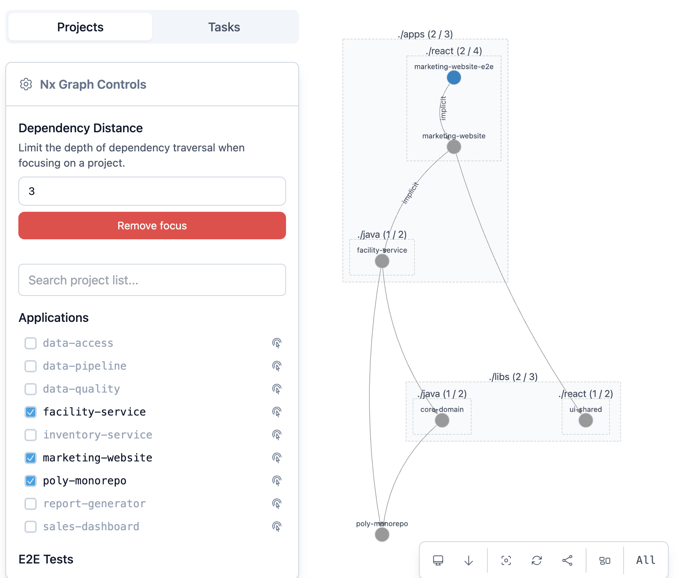

## Polyglot Monorepo Structure

```
/polyglot-monorepo/
├── .github/                      # CI/CD workflows (e.g., GitHub Actions)
│   └── workflows/
│       └── ci.yml
├── apps/                         # Contains all the deployable applications
│   ├── java/
│   │   ├── inventory-service/
│   │   │   ├── Dockerfile  # Dockerfile for the Inventory Service
│   │   │   ├── pom.xml
│   │   │   └── src/
│   │   │       ├── main/
│   │   │       │   └── java/
│   │   │       │   └── resources/
│   │   │       │       └── db/
│   │   │       │           └── changelog/
│   │   │       │               └── db.changelog-master.xml     # Liquidbase 
|   |   |       |               |── v1.0/
|   |   |       |                   |── 01-create-orders-table.xml
│   │   │       └── test/
│   │   │           └── java/
│   │   └── order-processing/
│   │       ├── Dockerfile  # Dockerfile for the Inventory Service
│   │       ├── pom.xml
│   │       └── src/
│   │           ├── main/
│   │           │   └── java/
│   │           └── test/
│   │               └── java/
│   ├── python/
│   │   ├── data-pipeline/
│   │   │   ├── Dockerfile  # Dockerfile 
│   │   │   ├── data_pipeline/
│   │   │   │   └── main.py
│   │   │   └── tests/
│   │   │       └── test_main.py
│   │   ├── report-generator/
│   │   │   ├── report_generator/
│   │   │   │   └── main.py
│   │   │   └── tests/
│   │   │       └── test_main.py
│   │   └── data-validator/
│   │       ├── data_validator/
│   │       │   └── main.py
│   │       └── tests/
│   │           └── test_main.py
│   └── react/
│       ├── marketing-website/
│       │   ├── Dockerfile  # Dockerfile 
│       │   └── src/
│       ├── marketing-website-e2e/  # Cypress E2E tests for marketing-website
│       │   └── cypress/
│       ├── sales-dashboard/
│       │   └── src/
│       └── sales-dashboard-e2e/    # Cypress E2E tests for sales-dashboard
│           └── cypress/
├── docs/                         # Project documentation
│   └── architecture.md
├── kube/                         # Kubernetes deployment manifests
│   ├── dev/
│   └── prod/
├── libs/                         # Shared libraries and packages
│   ├── java/
│   │   ├── core-domain/
│   │   │   ├── pom.xml
│   │   │   └── src/
│   │   │       ├── main/
│   │   │       │   └── java/
│   │   │       └── test/
│   │   │           └── java/
│   │   └── database-connector/
│   │       ├── pom.xml
│   │       └── src/
│   │           ├── main/
│   │           │   └── java/
│   │           └── test/
│   │               └── java/
│   ├── python/                     # Shared Python libraries
│   │   └── data-access/
│   │       ├── data_access/
│   │       │   └── db.py
│   │       └── tests/
│   │           └── test_db.py
│   ├── react/
│   │   ├── auth/
│   │   │   └── src/
│   │   └── ui-shared/
│   │       └── src/
│   │           └── components/
│   │               └── Button/
│   │                   ├── Button.cy.tsx  # Cypress component test for Button
│   │                   ├── Button.tsx
│   │                   └── index.ts
├── scripts/                      # General purpose scripts
│   ├── deploy/
│   └── test/
├── test-suites/                  # For integration, performance, and security tests
│   ├── jmeter/                   # Performance and load testing (JMeter)
│       ├── inventory-service/
│       │   └── api-tests.jmx
│       └── order-processing/
│           └── regression-suite.jmx
│   ├── k6/                       # Performance and load testing (k6 scripts)
│   ├── pact/                     # Consumer-driven contract tests
│   ├── postman/                  # API regression tests (Postman collections)
│   ├── playwright/               # Cross-application E2E browser tests
│   └── security/                 # Security scanning scripts (e.g., OWASP ZAP)
├── tools/                        # Workspace-specific tools and build scripts
│   └── build-scripts/
├── nx.json                       # Nx workspace configuration
├── package.json                  # Project dependencies and scripts
├── pom.xml                       # Parent POM for Java dependency management
└── tsconfig.base.json            # Base TypeScript configuration
```

## TODO
1. compare @nx/grade vs @jnxplus/nx-gradle (https://www.npmjs.com/package/@jnxplus/nx-gradle) official grade does not have java project generator and jnxplus has bug on dep resolution, eg. npx nx graph --file=output.json. output.json doesn't show full picture but it seems affected:build is able to resolve full deps.
2. there is no nx jmeter plugin and best way to approach is to build one similar to nx cypress e2e

## Need to make sure  
1. that build and test tools for java, react and python can support the folder structure
2. can build and test only affected
3. 


## How to express dependency btw react UI consuming backend Java app?
If marketing-website ui app uses facility-service, then you can manually add the following inside apps/react/marketing-website/project.json
```
{
  "name": "marketing-website",
  ...
  "implicitDependencies": ["facility-service"],
```
facility-service has dep on core-domain lib and this dep is expressed in apps/java/facility-service/build.gradle
```
dependencies {
  implementation project(':libs:java:core-domain')
  implementation 'org.springframework.boot:spring-boot-starter-web'
  ...
}
```
You can visualize the deps using cmd 
```
npx nx graph 

or

npx nx graph --affected 

or

npx nx graph --focus=marketing-website
```
By the way, when i setup marketing-website-e2e, the dep is set on marketing-website and you can visualize it by running cmd below and increase the dep distance in the ui
```
npx nx graph --focus=marketing-website-e2e
```


## How to create the folder structure? 

1. Using Nx commands to generate the folders is the correct and most efficient way to set up an Nx monorepo, as it automatically configures the projects and integrates them into the workspace.

2. Here are the Nx commands you would use to generate the projects and folders according to our finalized structure above, presented one by one.

3. First, create the non-Nx managed directories. These are folders that Nx doesn't have specific generators for, but are essential for your monorepo.
```
    1 # Create .github workflows directory
    2 mkdir -p .github/workflows
    3 
    4 # Create documentation directory
    5 mkdir -p docs
    6 
    7 # Create Kubernetes configuration directories
    8 mkdir -p kube/dev kube/int kube/test kube/prod
    9 
   10 # Create general scripts directories
   11 mkdir -p scripts/deploy scripts/test
   12 
   13 # Create test-suites directories
   14 mkdir -p test-suites/jmeter test-suites/k6 test-suites/pact test-suites/postman test-suites/playwright test-suites/security
   15 
   16 # Create tools directory
   17 mkdir -p tools/build-scripts tools/deploy-scripts
   18 
   19 # Create Ansible directories
   20 mkdir -p ansible/inventory ansible/roles/common/tasks ansible/roles/webserver/tasks ansible/playbooks
```
4. Next, generate the Nx-managed libraries. These commands will create the library projects and their basic structure, including src/ and tests/ (for Python/Java) or src/ (for React).
```
    1 # Init workspace
    2 npx create-nx-workspace@latest poly-monorepo --preset=apps --nxCloud=skip --interactive=false (init workspace)
    3 code poly-monorepo

    4 npm install --save-dev @jnxplus/nx-gradle 
    5 npx nx g @jnxplus/nx-gradle:init (install gradle wrapper)
    
    6 npx nx g @jnxplus/nx-gradle:application inventory-service --project-name=inventory-service --directory=apps/java
    7 npx nx g @jnxplus/nx-gradle:application facility-service --project-name=facility-service --directory=apps/java
    8 npx nx g @jnxplus/nx-gradle:library core-domain --project-name=core-domain --directory=libs/java
    9 npx nx g @jnxplus/nx-gradle:library elastic --project-name=elastic --directory=libs/java

    10 npm install -D @nxlv/python (install python plugin where poetry manages python)
    11 npx nx g @nxlv/python:poetry-project data-access --directory=libs/python/data-access
    12 npx nx g @nxlv/python:poetry-project data-quality --directory=libs/python/data-quality
    13 npx nx g @nxlv/python:poetry-project data-pipeline --directory=apps/python/data-pipeline
    14 npx nx g @nxlv/python:poetry-project report-generator --directory=apps/python/report-generator

    15 npm install --save-dev @nx/react 
    16 npx nx generate @nx/react:app marketing-website --directory=apps/react/marketing-website --e2eTestRunner=cypress --componentTestRunner=cypress
    17 npx nx generate @nx/react:app sales-dashboard --directory=apps/react/sales-dashboard --e2eTestRunner=cypress --componentTestRunner=cypress

    18 npx nx generate @nx/react:library auth --directory=libs/react/auth
    19 
    20 npx nx generate @nx/react:library ui-shared --directory=libs/react/ui-shared
    21 npx nx generate @nx/react:cypress-component-configuration --project=ui-shared 
  --generateTests
```

  Important Notes After Generation:

   * Files: Nx generators create the basic project structure. Files like Dockerfile, pom.xml (within projects), 
     db.changelog-master.xml, main.py, db.py, Button.tsx, Button.cy.tsx, index.ts, ci.yml, architecture.md, ansible.cfg, *.jmx, 
     *.yml (inventory/playbooks) are files that you would typically add manually or through other specific generators/scripts 
     after the initial project generation.
   * Java Idiomatic Structure: For Java projects, after generation, you would manually adjust the src/ directory to 
     src/main/java and src/test/java as discussed, and place your pom.xml and Liquibase files accordingly.
   * Parent POM: Remember to create the root pom.xml manually for centralized Java dependency management.
  
# Note 
* java facility service app uses java core domain lib and there are 2 ways to build it. 
  * npx nx build facility-service (nx is smart enough to build core domain on needed basis)
  * npx nx affected --target=build
  * npx nx affected:build 
* building facility service will create a jar file which includes core-domain jar
* to run facility service, 
  * npx nx serve facility-service